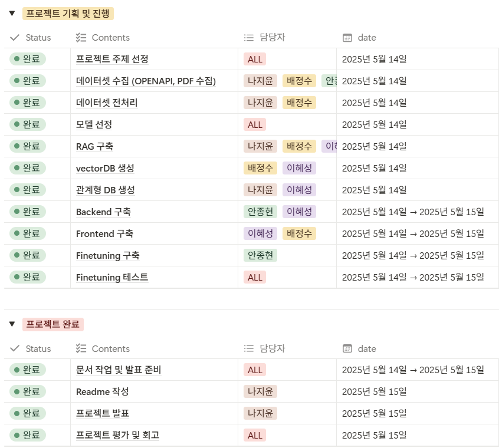
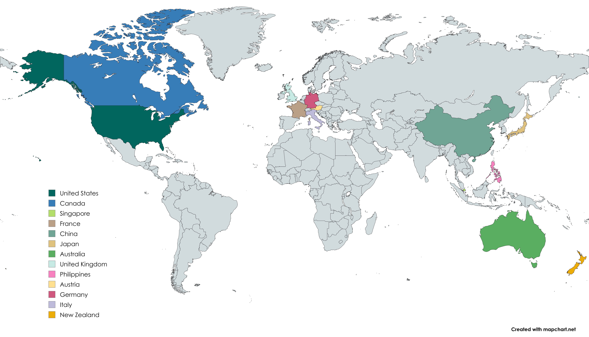
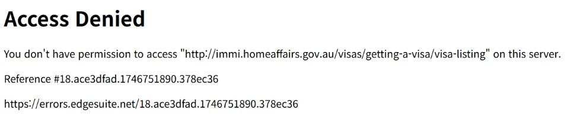

### SKN11-3rd-6Team
# Ready To Go 🌐

## 🛫 팀 소개
> **팀명: Wayfinder**  
- 여행자를 위한 정보의 나침반입니다.  
- 저희가 만드는 Ready To Go는,   
사용자들이 비자, 보험, 안전 정보 같은 어려운 문제 앞에서 헤매지 않도록 기술과 데이터를 통해 **가장 안전하고 정확한 길을 안내합니다.**  

> **GitHub** 
<table>
  <thead>
    <tr>
      <td align="center">
        <a href="https://github.com/Nadaeji">
          <br />
          <strong>나지윤</strong>
        </a>
      </td>
      <td align="center">
        <a href="https://github.com/SOOSOO999">
          <br />
          <strong>배정수</strong>
        </a>
      </td>
      <td align="center">
        <a href="https://github.com/hyunahn23">
          <br />
          <strong>안종현</strong>
        </a>
      </td>
      <td align="center">
        <a href="https://github.com/comet39">
          <br />
          <strong>이혜성</strong>
        </a>
      </td>
    </tr>
  </thead>
</table>

---
---
## ✈️ 프로젝트 개요

### ☁️ 프로젝트명
> Ready To Go 🌐
- 여행자와 이민자를 위한 **AI 기반 정보 탐색 웹 플랫폼**

### ☁️ 소개 
> 해외 여행자 및 장기 거주자를 위한 AI 챗봇 기반 정보 탐색 시스템
- 비자, 보험, 입국 규정, 여행 안전 정보 등 실질적이고 신뢰할 수 있는 내용을, 내외부 문서와 API에서 수집하고, RAG와 LLM으로 실시간 응답해줍니다. 
- 이 서비스는 실제 사용자들이 겪는 **정보 부족, 복잡한 문서, 언어 장벽** 문제를 해결하는,  
**지능형 안내 웹**으로 발전할 수 있습니다. 

### ☁️ 필요성
> 사용자들은 출발 전 필수 정보(비자, 보험, 입국 규정 등)를 **다양한 사이트에서 따로따로 검색**해야 함
- 대사관·정부 기관의 문서 기반 정보 수집 자동화 필요
- 단순 검색이 아닌 **의도 중심 질의응답 시스템** 필요

### ☁️ 목표
> 세계 곳곳의 정보를 사용자에게 **쉽게**, **빠르게**, **정확하게** 전달하는,  
> **"여행·이민의 길잡이 웹 플랫폼"** 으로의 진화를 목표로 합니다.
---
---

## ✈️ 기술 스택 & 사용한 모델

| 분야 | 도구 |
|------|------|
| **LLM** | GPT-3.5-turbo, Flan-T5 (LoRA 파인튜닝), Gemini |
| **Embedding** | OpenAI `text-embedding-3-small`, `sentence-transformers/all-MiniLM-L6-v2`|
| **Vector DB** | ChromaDB |
| **문서처리** | PyMuPDF, LangChain TextSplitter, deep-translator |
| **백엔드** | FastAPI, SQLAlchemy |
| **DB** | MySQL |
| **기타** | dotenv, Pydantic, Uvicorn |

---
---
## ✈️ 시스템 아키텍처 및 워크플로우

### ☁️ 문서 처리 흐름

```plaintext
PDF 수집 → 텍스트 추출 → 청크 분할
→ OpenAI 임베딩 생성
→ ChromaDB 벡터 저장 (with 메타데이터)
```

### ☁️ 질의응답 흐름

```plaintext
사용자 질문 (한국어)
→ 영어 번역 → RAG로 문서 검색 (MMR)
→ GPT-3.5 or Fine-tuned 모델에 context와 함께 프롬프트 생성
→ 응답 생성 → 한국어 번역 → DB 저장 및 응답
```

### ☁️ 파인튜닝 흐름

```plaintext
ChromaDB 문서 → QA 자동 생성
→ huggingface dataset 구성
→ Flan-T5 모델에 LoRA 파인튜닝
→ 새로운 LLM 응답 모델로 사용
```
---
---
## ✈️ WBS

---
---  
## ✈️ 수집 데이터

- **카테고리**: 비자 / 보험 / 국가별 여행 안전정보 / 입국절차·규정
- **형태**:
  - 대부분 `.pdf` (공식 대사관·기관 공지문)
  - 여행안전정보: 공공데이터포털 OpenAPI 활용
- **저장 구조**: 국가_문서유형.pdf → 국가/유형 기반 태깅 저장

---
---
## ✈️ 구현 명세서

### ☁️ 주요 모듈

- `RAG`: ChromaDB 기반 문서 검색 + 다국어 번역 포함
- `LLM`: OpenAI / Gemini / 파인튜닝 모델 기반 응답 생성
- `ChatService`: 대화 처리 및 API 서비스 로직
- `VectorDBRAGFineTuner`: QA 생성 + LoRA 기반 파인튜닝

### ☁️ 데이터베이스 설계

> **관계형 DB**

- `documents`: 문서 정보 (국가, 주제, 출처 포함)
- `conversations`: 대화 세션 정보
- `messages`: 사용자/AI 메시지 + 참조 정보
- `faqs`: 예시 질문

> **Vector DB**

- `global-documents` 컬렉션 (ChromaDB)
- 메타데이터: country, document_type, tag, language, updated_at

### ☁️ API 명세

| 구분 | 메서드 | 엔드포인트 |
|------|--------|-------------|
| Chat | POST | `/api/chat/conversation` |
| Chat | POST | `/api/chat/message` |
| Chat | GET | `/api/chat/history/{id}` |
| Chat | GET | `/api/chat/settings/models` |
| Chat | GET | `/api/chat/examples` |
| Meta | GET | `/api/countries`, `/topics`, `/sources` |
| Docs | GET | `/api/documents/{country}/{topic}` |
| Docs | GET | `/api/documents/{id}` |
| Docs | GET | `/api/documents/search?q=...` |

---
---
## ✈️ RAG 및 LLM 통합 구현

```python
# RAG 검색
context, references = rag.search_with_translation(
    query="호주 취업비자 신청 조건은?",
    country="australia",
    doc_type="visa_info"
)

# LLM 응답 생성
response = await llm.generate_with_translation(
    query="호주 취업비자 신청 조건은?",
    context=context,
    references=references
)
```
- RAG는 MMR 방식으로 문서 검색 정확도 향상
- context 기반 응답 → LLM으로 생성 → 자동 번역
---
---
## ✈️ DB 연동 구현 코드
### [링크](https://drive.google.com/drive/folders/1Tpqjcyy5QZZGoZL1YKsrUEsv2veF81Xa?usp=sharing)
---
---
## ✈️ 수행 결과 요약

- 사용자 질문 → LLM 응답 생성까지 자동화 완성
- Fine-tuned 모델 적용으로 도메인 적합 응답 확보
- 국가·주제별 필터링, 예시 질문, 다국어 번역 등 UX 강화
- 문서 기반 실시간 챗봇 응답 구현
---
---
## ✈️ 진행 과정 중 프로그램 개선 노력
> ### ☁️ 웹 크롤링 차단
- 정보 출처가 공식 기관이다 보니, 웹 크롤링 불가


> ### ☁️ 학습 데이터의 편향
- 프랑스 비자 질문을 했는데, 모델은 엉뚱한 답을 했습니다.  
- 예측: **프랑스 관광비자 관련 QA가 아예 학습에 없었던 것**
  - **질문 생성 과정에서 무작위로 하나만 뽑는 방식**  
  - 특정 국가·주제의 coverage가 비었을 가능성

> ### ☁️ RAG 검색의 '노이즈'
- `similarity`, `k=1`로 변경
  - 처음엔 `search_type="mmr"`로 다양한 context를 불러왔으나,  
  - Flan-T5 모델은 **짧고 명확한 context**만 잘 처리  

> ### ☁️ 모델의 한계
- 방안: **GPT 스타일을 ‘모방’하게 학습**  
  - GPT는 어떤 질문도 잘 대답함  
  - 하지만 Flan-T5는,
    - 문장이 길면 이해를 못하고
    - 질문-정답 관계를 외우지 않으면 말이 안 되는 답 냄
---
### ☁️ 극복 방안: 테스트 및 성능 결과
| 항목 | 결과 |
|------|------|
| 문서 수집 | 약 60개 PDF → 3,200개 청크 |
| QA 생성 | GPT로 생성한 QA 쌍 약 900개 |
| 파인튜닝 | Flan-T5 + LoRA 기반 학습, 정답률 개선 |
| RAG 성능 | MMR → similarity 변경 후 정확도 향상 |
| 응답 성능 | GPT > Fine-tuned T5 >>> 기본 모델 |
---
---
## ✈️ 앞으로의 개선 방향
- `generate_topic_questions()` 개선 (랜덤 뽑기 → 전체 보존)
- QA 쌍 coverage 점검 스크립트 제작
- context 압축 기법 도입 (LLM에게 더 요약된 컨텍스트 주기)
- 파인튜닝 모델 정제 및 학습 반복
---
---
## 🛬 한 줄 회고
☁️ 나지윤 
> "처음엔 단지 '챗봇을 만들자'가 저희의 목표였습니다. 문서의 구조를 이해하고, 정보를 정제하고, 모델이 무엇을 알아듣고 무엇을 못 알아듣는지를 처음부터 배웠습니다. 질문 하나가 만들어지기까지, 그 질문에 '좋은' 답변을 추출하기까지 얼마나 많은 과정과 고뇌가 필요한 지 몸소 느꼈습니다. 그래서 결국 우리가 만든 건, 단순 챗봇이 아닌, 정보를 담는 구조였음을 깨달았고, 그 방법을 배울 수 있었습니다." 


☁️ 배정수
> "프로젝트를 진행하는 동안 데이터를 어떻게 처리해야 하는지, 어떤 방식으로 벡터DB에서 관련문서를 찾아와야 하는지에 대한 고찰이 많이 필요한 프로젝트였습니다. 그리고 RAG와 파인튜닝 학습을 시키는 방식에 대해 데이터의 형태, 파라미터, 모델 선정, 프롬프트 등 팀원들 사이에 다양한 의견 교환이 있었는데, 실질적으로 실행에 옮겨볼 시간이 부족해서 일반적으로 어떠한 방식이 좋다고 알려진 방식으로만 진행할 수밖에 없어서 그 부분이 많이 아쉬웠습니다. "

☁️ 안종현
> "냥냥"

☁️ 이혜성
> "냥냥"
